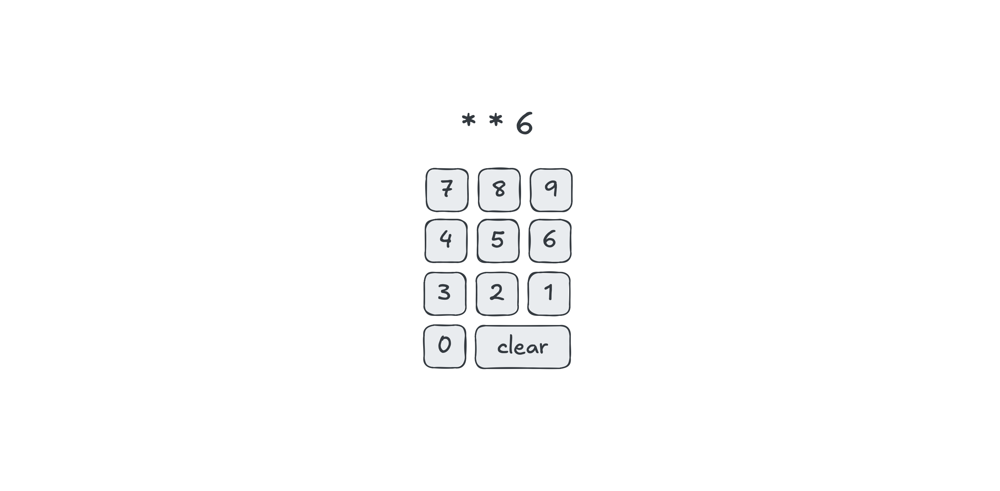

# Devoir 6 : Propagation

Concevez une interface web contenant un clavier numérique pour entrer un
NIP à 4 chiffres. Lorsque l'utilisateur ou l'utilisatrice entre son NIP,
seulement le dernier chiffre doit être montré. Les chiffres précédents
doivent apparaître comme des astérisques. Le clavier doit également
inclure un bouton qui permet d'effacer tous les chiffres entrés
précédemment. Il vous est permis d'enregistrer un seul gestionnaire
d'événement.
