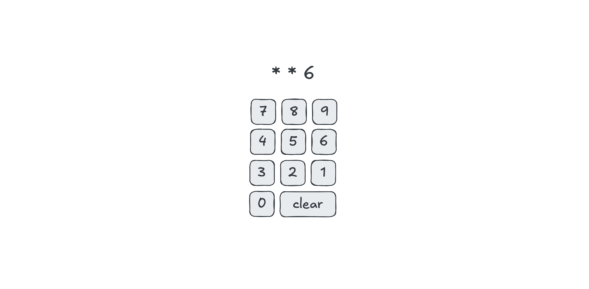

# Devoir : Propagation

Concevez une page Web contenant un clavier numérique permettant d'entrer
un NIP à 4 chiffres. Lors de la saisie du NIP, seul le dernier chiffre
entré est visible. Les chiffres précédents sont remplacés par des
astérisques.

Le clavier doit également inclure un bouton permettant d'effacer tous les
chiffres entrés. Vous ne pouvez enregistrer qu'un seul gestionnaire
d'événement.
